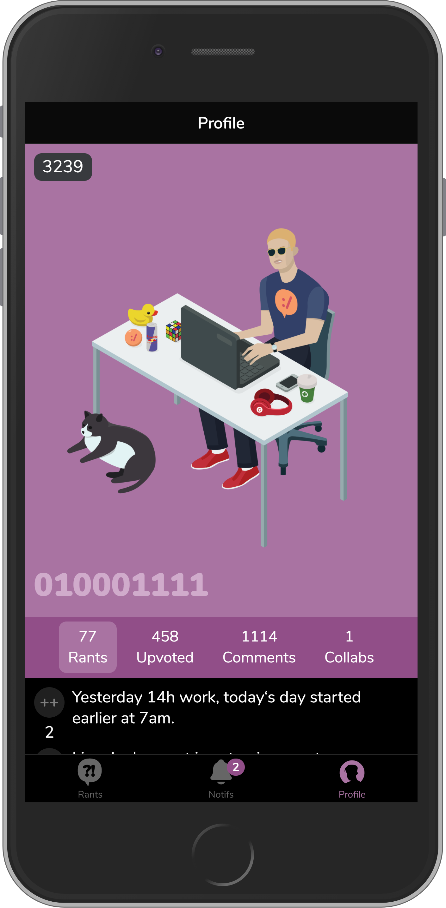
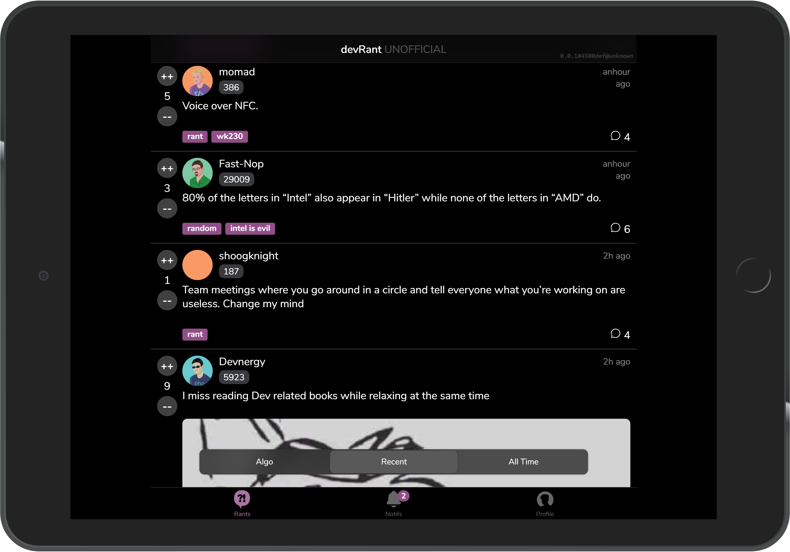
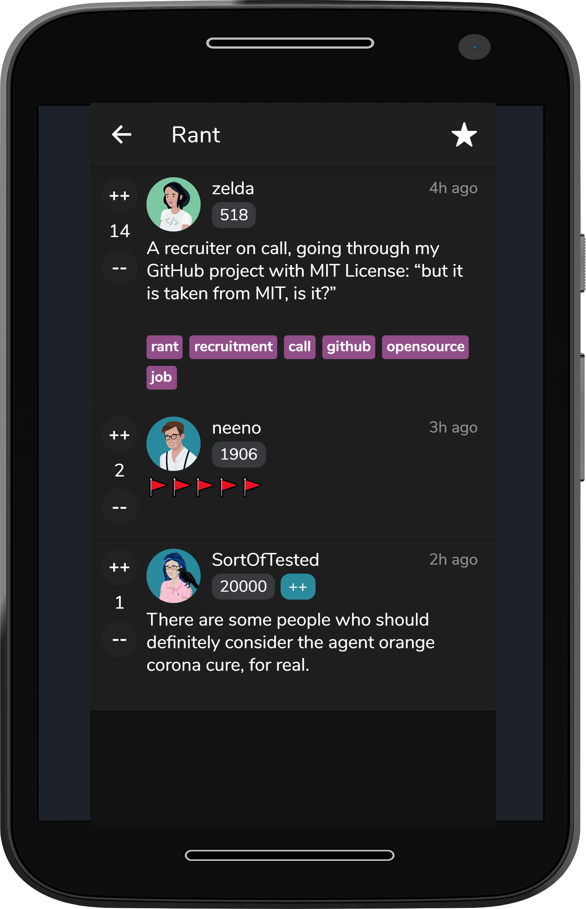

# devRant PWA (UNOFFICIAL)

[devRant](https://devrant.com/) as progressive web application. The primary goal of this project is to provide an alternative, future-proof client to the existing applications. In the course of the implementation, the existing problems of the currently official applications are to be solved and if necessary improved.

THIS PROJECT IS MAINTED BY THE COMMUNITY AND **NOT** OFFICIALY SUPPORTED BY DEVRANT.

A few of them are as following:

-   No more random crashes
-   Accesabillity
-   Usability
-   Load times
-   Identical feature sets on all platforms
-   Respect to the operating system while maintaining devRant's unique Branding
-   Extensive options for customization (additional themes)

## Technology stack

The primary language for all implementations is [TypeScript](https://www.typescriptlang.org/).  
The framework of choice has been declared to [Angular](https://angular.io/) using the [Ionic Framework](https://ionicframework.com/).

Complementing to core UI-Components, [Stencil](https://stenciljs.com/) may be used.

## Status

The latest commit of the default branch will always be present at [next.devrant.app](https://next.devrant.app/).  
Stable versions on `main` will be deployed to [devrant.app](https://devrant.app/).

A changelog generation is not yet completed.

## Dependencies

You will require [node.js](https://nodejs.org/) with at least version 12, preferably always using latest.

## Installation

To get started, simply install the project dependencies using `npm install`.  
After that's done, type `npm start` to run the project.

After a little warmup, the app will be opened in your browser under `http://localhost:8100/`.

If you're running the project under WSL2, use `npm start:wsl2` instead.

## Configuration

Please see under `src/environments/environment.ts` what you may be able to configure in your development environment.

## How to test the software

It would be nice to write tests, but to encourage contribution and possibly speed the development process up, tests are not required to write.

That aside, please test your features extensively locally before creating PR's.  
Additionally, code style guidelines apply and the lint process is done on every commit.

There is no custom code-style; standard ESLint rules apply.
Currently, the project is still using `tslint`, which is deprecated in favour of ESLint TypeScript plugins.

## Getting help

If the Issue tracker does not include enough information or you need additional support, feel free to join our [Discord](https://discord.gg/YcpWxAR).

## Getting involved

This project targets a big change and needs extensive support from you guys to make it a reality.

devRant has many members from different business sectors, which we should use to develop the best possible product.

Whether you are a backend, frontend, or tester, any feedback and opinions will help us to build the best PWA for all of us.

If you feel ready to make a change, check our [issue tracker](https://github.com/dr010001111/devrant-pwa/issues) what you can do.

Found something? Then please also check out our [contribution details](CONTRIBUTING.md) before creating an PR.

## References

-   [ts-devrant](https://www.npmjs.com/package/ts-devrant)
-   [devRant-SwiftUI](https://github.com/OmerFlame/devRantSwiftUI)
-   [devRant API](https://devrantapi.docs.apiary.io/)

---

-   [Ionic Docs](https://ionicframework.com/docs)
-   [Angular Docs](https://devdocs.io/angular/)

---

Thanks for reading. This project originates from germany and contains a lot of ♥
